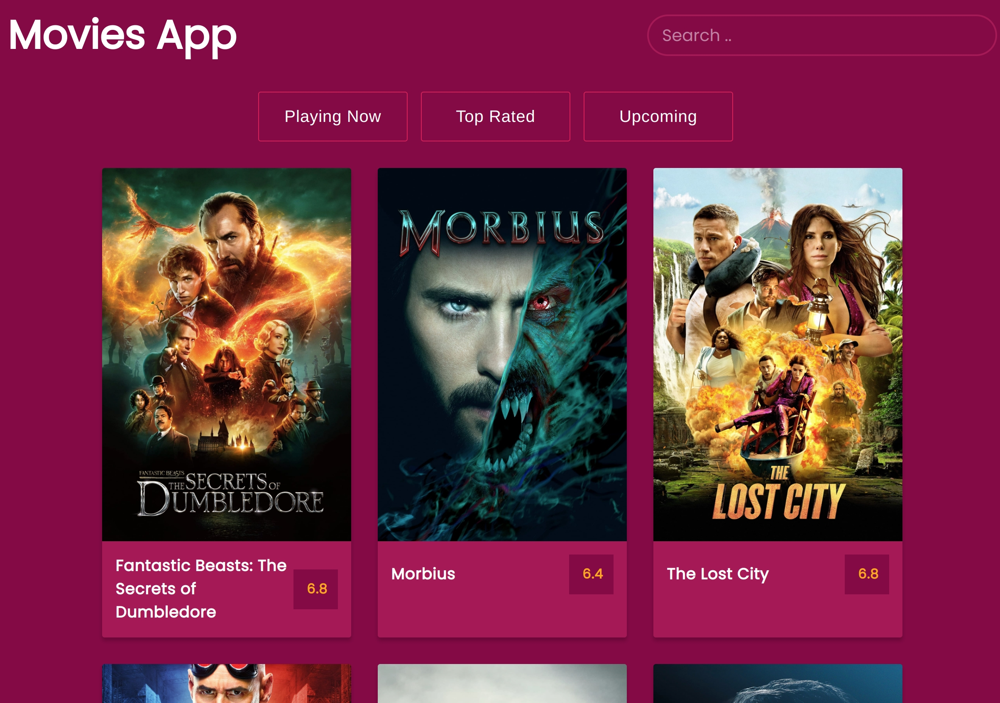

# Movies App
I've just learned the #fetchAPI by creating this simple Movie App.
demo: https://lnkd.in/e_SKE2sc
github: https://lnkd.in/e3n-DvHR

Infinite scroll => #javascript + #css #animation
Search => from the themoviedb.org

A simple Movie App made with Vanilla Javascript  
If you find this useful please give this repository a star :star:

# Demo
[Movie App](https://mannar.ch/projects/movies/index.html) 

# Features
It contains the following features:
1. Search
2. Infinate Scroll

# Run
Open `index.html` in browser.
